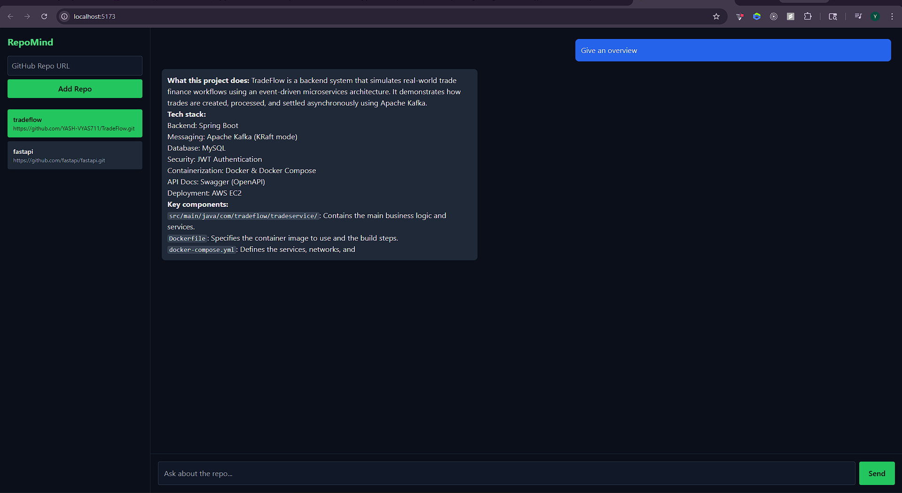

# 🚀 RepoMind

> ChatGPT for GitHub repositories — fully local, code-grounded RAG system

RepoMind lets you query any GitHub repository using natural language and get answers grounded directly in the codebase.

---

## 🔥 Demo



---

## 🧠 What it does

- Ask questions like:
  - *"Give me an overview of this project"*
  - *"Where is authentication implemented?"*
  - *"Explain how the API works"*

- RepoMind will:
  - Retrieve relevant code
  - Build structured context
  - Generate answers using a local LLM

---

## ⚙️ Tech Stack

### 🖥 Frontend
- React (Vite)
- Tailwind CSS
- Streaming UI (ChatGPT-like)

### ⚙️ Backend
- FastAPI
- LangChain

### 🧠 AI / RAG
- Embeddings: `BAAI/bge-base-en`
- Vector DB: ChromaDB (persistent)
- LLM: `qwen2.5-coder` via Ollama

---

## 🧱 Architecture
GitHub Repo
↓
Clone + Filter Files
↓
Smart Chunking (function-aware)
↓
Embeddings (BGE)
↓
ChromaDB
↓
Retriever (semantic + deterministic)
↓
Context Builder
↓
LLM (Ollama)
↓
Streaming Response (UI)


---

## 🔍 Key Features

### 🧠 Smart Chunking
- Function / class-aware splitting
- Fallback size-based chunking
- Small file optimization

### 🔎 Hybrid Retrieval
- Semantic search (embeddings)
- Deterministic file lookup (filename-based)
- Query expansion (API → axios, fetch, etc.)

### 📄 Context Engineering
- README-aware overview mode
- Structured grouping:
  - backend
  - frontend
  - readme
- Character budget control

### ⚡ Performance Optimizations
- Embedding caching (LRU)
- Batch vector insertion
- Deduplication + per-file limits

### 🎯 Evaluation System
- Accuracy
- MRR (Mean Reciprocal Rank)
- Precision@k
- Recall@k

👉 Achieved ~70% retrieval accuracy across real-world repos

---

## 💻 UI Features

- Multi-repo support (ChatGPT-style)
- Streaming responses
- Dark, developer-focused UI
- Repo switching like chat sessions

---

## 🚀 Getting Started

### 1. Clone the repo

```bash
git clone https://github.com/YASH-VYAS711/RepoMind.git
cd RepoMind

2. Backend setup
cd backend
pip install -r requirements.txt
uvicorn main:app --reload

3. Frontend setup
cd frontend
npm install
npm run dev

4. Run Ollama (required)
ollama serve
ollama pull qwen2.5-coder:14b
